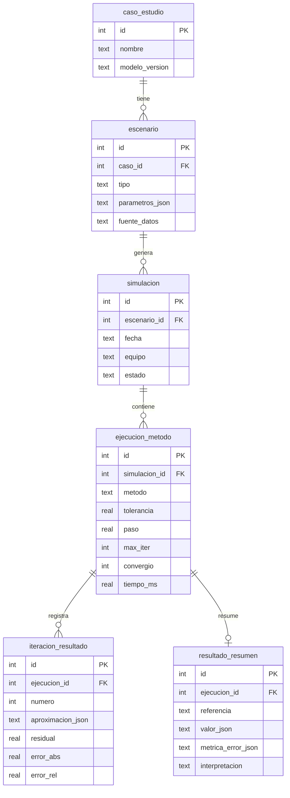

# DER (Mermaid; se visualiza en GitHub)

```mermaid
erDiagram
  caso_estudio ||--o{ escenario : tiene
  escenario ||--o{ simulacion : genera
  simulacion ||--o{ ejecucion_metodo : contiene
  ejecucion_metodo ||--o{ iteracion_resultado : registra
  ejecucion_metodo ||--o| resultado_resumen : resume
  caso_estudio { int id PK  text nombre  text modelo_version }
  escenario { int id PK  int caso_id FK  text tipo  text parametros_json  text fuente_datos }
  simulacion { int id PK  int escenario_id FK  text fecha  text equipo  text estado }
  ejecucion_metodo { int id PK  int simulacion_id FK  text metodo  real tolerancia  real paso  int max_iter  int convergio  real tiempo_ms }
  iteracion_resultado { int id PK  int ejecucion_id FK  int numero  text aproximacion_json  real residual  real error_abs  real error_rel }
  resultado_resumen { int id PK  int ejecucion_id FK  text referencia  text valor_json  text metrica_error_json  text interpretacion }
```
Modelo relacional: ver `sql/schema.sql` (PK/FK, CHECK en `tipo`, ON DELETE CASCADE).
